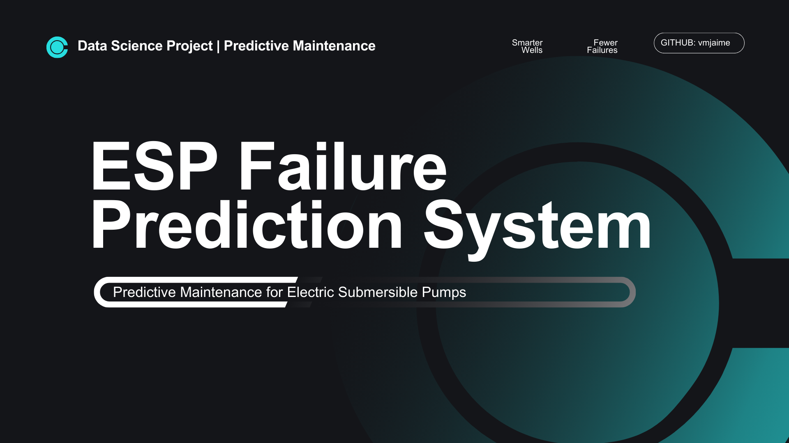

  

# ⚡ ESP Failure Prediction System

**Predicción de fallas en bombas electro sumergibles (ESP) con Machine Learning.**  
Analiza datos de sensores (corriente, presión, vibración, frecuencia, temperatura) para **anticipar fallas**, reducir paros de producción y optimizar mantenimientos.  

🚀 Proyecto en construcción con alto potencial de aplicación en la industria petrolera.  

---

## 🎯 Objetivo
Implementar **mantenimiento predictivo** en lugar de correctivo, evitando:
- Costos de intervención no programada  
- Pérdida de producción por paros de pozo  
- Riesgos en la integridad de los equipos  

---

## 📂 Estructura
ESP-Failure-Prediction-System/
│── data/ # Datos crudos y procesados
│── notebooks/ # EDA, preprocesamiento y modelado
│── src/ # Pipelines y funciones
│── README.md

---

## 🛠️ Tecnologías
🐍 Python | 📊 pandas, numpy | 🤖 scikit-learn | 📈 matplotlib  

---

## 📌 Estado
✅ EDA finalizado (clasificación de pozos y datasets filtrados)  
⚙️ Preprocesamiento en curso (imputación y features)  
🚧 Próximo: modelado predictivo y despliegue
