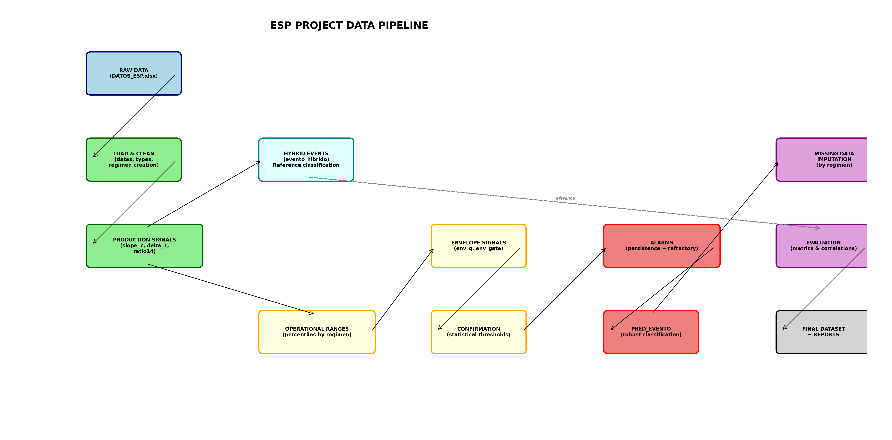
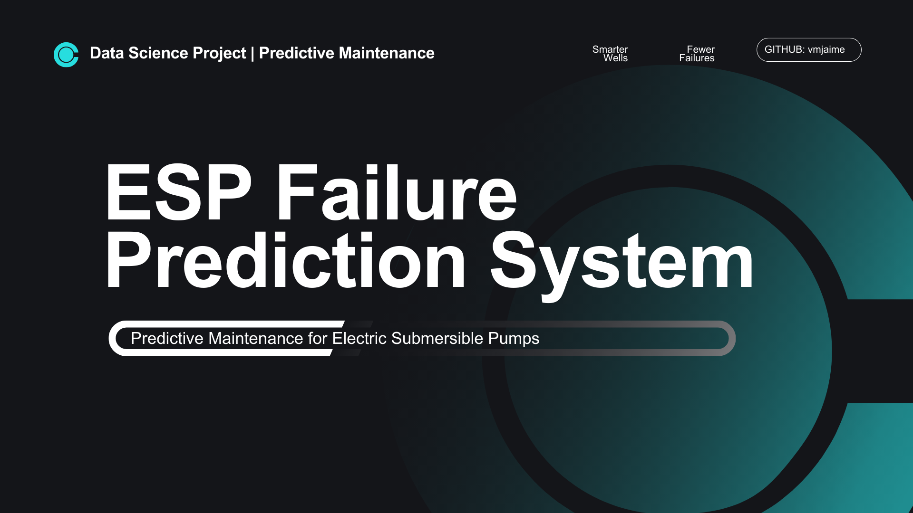

# ESP Project - Pipeline Modular para Predicción de Eventos en Pozos ESP

## Resumen

Este proyecto implementa un pipeline modular completo para procesar datos de pozos ESP (Electric Submersible Pump) y predecir eventos operacionales. El sistema transforma datos crudos en formato de predicción listo para uso, utilizando métodos estadísticos y mejoras de calidad de datos.

## Estructura del Proyecto

```
ESP_Project/
├── Datos/                    # Archivos de datos crudos
├── processed_data/          # Salidas de datos procesados
├── notebooks/               # Notebooks principales
│   └── demo_pipeline.ipynb  # Demo del pipeline modular completo
├── src/                     # Código fuente modular
│   ├── data_pipeline.py     # Script principal del pipeline
│   ├── eda/                 # Módulos de análisis exploratorio
│   │   ├── signals.py       # Cálculos de señales (slope, delta, eventos)
│   │   ├── ranges.py        # Definición de rangos operacionales
│   │   └── imputation.py    # Métodos de imputación de datos
│   └── evaluation/          # Módulos de evaluación
│       └── evaluate_predictions.py
├── EDA/                     # Notebooks del flujo original (referencia histórica)
│   ├── 02_tratamiento_outliers.ipynb
│   ├── 03_metodoDiferencialPro.ipynb
│   ├── 04_Definicion_RangosOperacionales.ipynb
│   ├── 05_DefinirRangos.ipynb
│   ├── 06_ImputacionDatos.ipynb
│   └── 07_EvaluacionPred_Evento.ipynb
├── archive/                 # Archivos archivados (no usar en producción)
│   ├── notebooks/          # Notebooks redundantes/exploración
│   └── data/               # Archivos Excel antiguos
├── Tratamiento/             # Scripts de procesamiento legacy (referencia)
├── freeze/                  # Snapshots de datos
├── requirements.txt         # Dependencias Python
└── README.md               # Este archivo
```

## Flujo del Pipeline Modular

### Diagrama General


### 1. Datos Crudos → Carga y Limpieza
- Carga datos desde `DATOS_ESP.xlsx` (46 hojas de pozos)
- Limpieza de fechas y conversión de tipos
- Creación de columna `regimen_id` (pozo + tipo de bomba)
- Eliminación de columnas innecesarias

### 2. Señales de Producción
- **slope_7/slope_14**: Regresión lineal en ventanas móviles (7/14 días)
- **delta_1/delta_3**: Diferencias diarias en producción
- **ratio14**: Razón relativa de cambio en 14 días

### 3. Eventos Híbridos (Referencia)
- Clasificación original usando umbrales estadísticos
- Combinación de señales slope/delta para detectar caídas/subidas
- Sirve como referencia para comparación

### 4. Rangos Operacionales
- Cálculo estadístico usando método IQR (Q1-1.5*IQR, Q3+1.5*IQR)
- Variables operacionales: frecuencia, presiones, corriente, temperatura
- Rangos por régimen (combinación pozo+bomba)

### 5. Señales de Envelope
- **env_q**: Validación de producción dentro de rangos normales
- **env_gate**: Detección de condiciones operacionales anormales

### 6. Confirmación Estadística
- Umbrales estadísticos por pozo (medias y desviaciones)
- Validación de señales usando distribución histórica

### 7. Alarmas con Persistencia
- Lógica de alarmas instantáneas
- Persistencia mínima de 2 períodos consecutivos
- Período refractario para evitar falsos positivos

### 8. Pred_Evento (Clasificación Robusta)
- Sistema de predicción principal usando rangos operacionales
- Más conservador y confiable que eventos híbridos
- Listo para aplicaciones industriales

### 9. Imputación de Datos Faltantes
- Análisis de patrones de datos faltantes
- Imputación por grupos (regimen_id) usando medianas
- Preservación de integridad temporal

### 10. Evaluación y Validación
- Correlaciones con tendencias de producción
- Métricas de calidad de predicción
- Comparación entre eventos híbridos y pred_evento

## Características Principales

### 🏗️ Arquitectura Modular
- **6 módulos especializados** con responsabilidades claras
- Código limpio con type hints y documentación completa
- Logging comprehensivo y manejo de errores robusto
- Resultados reproducibles

### 📊 Enfoque en Calidad de Datos
- Detección estadística de outliers
- Análisis y tratamiento de datos faltantes
- Validación contra reglas de negocio
- Correlaciones para selección de features

### 🎯 Rangos Operacionales Inteligentes
- Cálculo basado en IQR (robusto a outliers)
- Umbrales normal vs alerta diferenciados
- Rangos específicos por régimen operativo

### 📈 Sistema de Predicción Robusta
- **Pred_Evento**: Clasificación principal (conservadora)
- **Evento_Hibrido**: Referencia histórica
- Validación estadística completa
- Métricas de rendimiento detalladas

## 🚀 Uso del Sistema

### Prerrequisitos
```bash
# Instalar dependencias
pip install -r requirements.txt

# Activar entorno virtual (recomendado)
venv_esp\Scripts\activate  # Windows
```

### Opción 1: Notebook Interactivo (Recomendado)
```bash
# Abrir Jupyter y ejecutar el notebook demo
jupyter notebook notebooks/demo_pipeline.ipynb
```

El notebook `demo_pipeline.ipynb` incluye:
- ✅ Verificación automática de archivos
- ✅ Ejecución completa del pipeline
- ✅ Visualizaciones interactivas
- ✅ Análisis de resultados
- ✅ Evaluación de rendimiento

### Opción 2: Ejecución por Script
```bash
# Ejecutar pipeline completo
python src/data_pipeline.py

# Los resultados se guardan en processed_data/
```

### Archivos de Salida
- `processed_data/processed_data.parquet`: Dataset final procesado
- `processed_data/operational_ranges.parquet`: Rangos operacionales calculados
- `processed_data/missing_data_analysis.parquet`: Reporte de datos faltantes
- `processed_data/imputation_report.parquet`: Resultados de imputación
- `pipeline_diagram.png`: Diagrama del flujo del pipeline
- `signals_diagram.png`: Explicación de señales calculadas
- `classification_diagram.png`: Lógica de clasificación de eventos

## Usage

### Prerequisites
```bash
pip install -r requirements.txt
```

### Running the Pipeline
```bash
cd src
python data_pipeline.py
```

### Output Files
- `processed_data.parquet`: Final processed dataset
- `operational_ranges.parquet`: Calculated operational ranges
- `strict_ranges.parquet`: Strict quality ranges
- `missing_data_analysis.parquet`: Missing data report
- `imputation_report.parquet`: Imputation results

## Data Dictionary

### Key Variables
- `name_`: Well identifier
- `date`: Date of measurement
- `evento_hibrido`: Original event labels (with noise)
- `pred_evento`: Cleaned prediction labels
- `regimen_id`: Well + pump type combination

### Production Variables
- `prueba_pozooil_24__prueba_pozowater_24`: Total production (oil + water)
- `prueba_de_producción_gas_a_24_horas_mcfd`: Gas production

### Operational Variables
- `frecuencia_bomba_hz`: Pump frequency
- `presion_de_intake_psi`: Intake pressure
- `amperaje_bomba_amp`: Pump current
- `presion_de_tubing_psi`: Tubing pressure
- `presion_de_casing_psi`: Casing pressure
- `temperatura_de_la_bomba_deg_f`: Pump temperature

## Methodology

### Range Calculation
Uses Interquartile Range (IQR) method:
- Normal range: [Q1 - 1.5×IQR, Q3 + 1.5×IQR]
- Alert range: [Q1 - 3.0×IQR, Q3 + 3.0×IQR]

### Event Prediction Labels
- 0: Normal operation
- 1: Mild anomaly
- 2: Severe anomaly

### Quality Assurance
- Correlation analysis with production variables
- Trend validation across prediction categories
- Missing data impact assessment

## Future Improvements

- [ ] Add automated model training pipeline
- [ ] Implement cross-validation for range parameters
- [ ] Add real-time prediction capabilities
- [ ] Create interactive dashboards for monitoring
- [ ] Implement A/B testing framework for range updates

## Contributing

1. Follow the modular structure
2. Add comprehensive logging
3. Include unit tests for new functions
4. Update documentation for API changes
5. Validate against existing test cases

## License

This project is proprietary. All rights reserved.

<p align="center">
  
</p>

# ⚡ ESP Failure Prediction System

**Predicción de fallas en bombas electro sumergibles (ESP) con Machine Learning.**  
Analiza datos de sensores (corriente, presión, vibración, frecuencia, temperatura) para **anticipar fallas**, reducir paros de producción y optimizar mantenimientos.  

🚀 Proyecto en construcción con alto potencial de aplicación en la industria petrolera.  

---

## 🎯 Objetivo
Implementar **mantenimiento predictivo** en lugar de correctivo, evitando:
- Costos de intervención no programada  
- Pérdida de producción por paros de pozo  
- Riesgos en la integridad de los equipos  

---

## 📂 Estructura
ESP-Failure-Prediction-System/
│── data/ # Datos crudos y procesados
│── notebooks/ # EDA, preprocesamiento y modelado
│── src/ # Pipelines y funciones
│── README.md

---

## 🛠️ Tecnologías
🐍 Python | 📊 pandas, numpy | 🤖 scikit-learn | 📈 matplotlib  

---

## 📌 Estado
✅ EDA finalizado (clasificación de pozos y datasets filtrados)  
⚙️ Preprocesamiento en curso (imputación y features)  

🚧 Próximo: modelado predictivo y despliegue
>>>>>>> 71ec66526f81494b6c7e6b3e0b1598759e1143d0

🛠️ Próximo: modelado predictivo y despliegue

This project is proprietary. All rights reserved.
>>>>>>> 5c7ba0eb49e6b4feecae6d8927cad69f917af802
